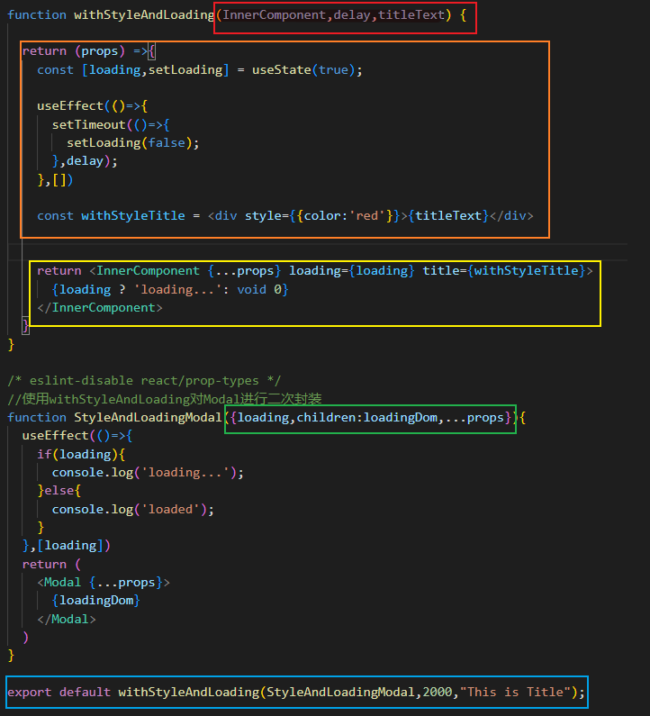

# HOC (High Order Component)

*   高阶组件：
    *   定义：一个函数组件，接收一个组件作为参数，返回一个新的增强的组件，可以为组件添加预定义的props，统一样式、逻辑
*   注意：编写高阶组件时，组件名应为小驼峰，否则eslint等会认为这是一个正常的JSX组件，在回调中编写Hook会警告；

## 实操

接下来编写一个Button和Modal，

*   Button具有权限校验的功能，并可以打开Modal，
*   Modal中有统一样式的Title 以及 加载状态（提供加载前后的显式状态）；

以这样一个Demo来演示HOC的使用场景，这里我们会借助Antd的Button和Modal对其进行二次封装

源码：[Github Link](https://github.com/Ys-OoO/React_Learning_Repository/blob/main/basic/src/components/HOC/Demo_1/withAuth.jsx)

### withAuth

```js
function withAuth(InnerComponent) {

  return function(props){
    const [hasAuth,setHasAuth] = useState(false);

    useEffect(()=>{
        async function checkAuth(){
            setTimeout(()=>{
                //模拟获取当前用户有权限
                setHasAuth(true);
            },1000);
        }
        checkAuth();
    })

    if(!hasAuth) return void 0;

    return <InnerComponent {...props}/>
  }
}
```

然后是进一步封装AuthButton，这里要注意的是AuthButton的props中可以接收我们在withAuth中返回的InnerComponent的props,即 `return <InnerComponent {...props}/>`;

```js
function AuthButton({...props}){
    return <Button {...props}>
        {props.children}
    </Button>
}

export default withAuth(AuthButton);
```

在这个例子中我们在withAuth高阶组件中维护了一个状态，该状态来决定是否渲染接收的组件InnerComponent。

### withStyleAndLoading

然后就是Modal了，首先编写带有样式和Loading状态的HOC

```js
function withStyleAndLoading(InnerComponent,delay,titleText) {
  return (props) =>{
    const [loading,setLoading] = useState(true);

    useEffect(()=>{
      setTimeout(()=>{
        setLoading(false);
      },delay);
    },[])

    const withStyleTitle = <div style={{color:'red'}}>{titleText}</div>
    return <InnerComponent {...props} loading={loading} title={withStyleTitle}>
      {loading ? 'loading...': void 0}
    </InnerComponent>
  }
}
```

可以看到我们为InnerComponent增强了props，传递了loading状态以及具有统一样式的Title。
这里的delay是为了模拟请求，实际开发中可以传入请求的url，然后再根据请求结果改变loading状态；

然后我们对Modal进行封装：

```js
function StyleAndLoadingModal({loading,children:loadingDom,...props}){
  useEffect(()=>{
    if(loading){
      console.log('loading...');
    }else{
      console.log('loaded');
    }
  },[loading])
  return (
    <Modal {...props}>
      {loadingDom}
    </Modal>
  )
}

export default withStyleAndLoading(StyleAndLoadingModal,2000,"This is Title");
```

至此，我们就可以进一步使用了：

```js
function App() {

  const [open,setOpen] = useState(false)
  const openModal = ()=>{
    setOpen(true);
  }
  
  return (
    <>
      <AuthButton onClick={openModal}>open</AuthButton>
      <StyleAndLoadingModal open={open}></StyleAndLoadingModal>
    </>
  );
}
```

我们可以看到，AuthButton会在校验成功后渲染，渲染后，由于请求Modal中请求还没有完成，我们此时打开Modal还可以看到Loading，并且Title的样式也成功渲染了。

# 总结

强烈建议大家都手敲一遍，然后可能还有困惑，接下来我们再总结一波：

高阶组件HOC实际上包括以下几个功能：

1.  他类似于一个包装函数，接收一个组件，和实现功能的一些参数，我们可以利用这些参数为InnerComponent提供一些功能；（url,titleText）
2.  他可以在渲染InnerComponent前使用Hook来实现一些共同逻辑；（权限校验，loading展示）
3.  可以为返回的InnerComponent传递一些预定义的props来增强组件，这些props可以在外部被我们使用（loading状态）

可以将高阶组件的编写分为以下几个阶段：

*   首先是入参阶段，这些入参中包括InnerComponent和一些参数，为后面几个阶段提供支持；
*   然后是组件返回前阶段，这个阶段可以自定义一些状态，变量以及使用Hook来完成一些功能或产生新的变量；
*   接下来是返回阶段，这个阶段可以使用前面的所有所有状态，变量来指定要渲染的InnerComponent，将上面两个阶段中的变量转换为props进行传递；
*   然后是InnerComponent的定义阶段，在编写具体的InnerComponent时，要对接的是上一个阶段中预定义的props，这些props可以供具体的InnerComponent使用；
*   最后是暴露阶段，我们要对接的是第一个阶段中的入参，也可以说是HOC的实用阶段；

