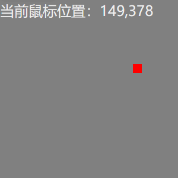

# Render Props

首先需要明确，render props 并不是使用名为 render 的这个 props，他与 hoc 类似，都是借助 React 的特性而可以实现的一种模式，官网是这样解释 render props 的： ==任何被用于告知组件需要渲染什么内容的 prop 函数，在技术上都可以被称为 render prop==(为此后续 demo 我们不使用 render)；

划重点：告知组件渲染什么内容的 prop 函数————> 那么这个东西就是一个函数，又是一个 props。你是否又想到什么？父子组件通信时，我们就是使用 props 完成的，那有什么不同呢？没错，**告知组件需要渲染什么内容**

## 实操

[Github Link](https://github.com/Ys-OoO/React_Learning_Repository/blob/main/basic/src/components/RenderProps/Demo/EasyModal.jsx)

### 练手

接下来，我们先根据官网的例子写一个:封装一个组件，它能够监听并显示当前鼠标在该组件的坐标；并且能够渲染一个我们需要的组件来实时跟踪； 

#### 第一步

封装一个组件，它能够监听并显示当前鼠标在该组件的坐标

```js
export default function MouseTracker({ ...props }) {
  const [mousePosition, setPosition] = useState({ x: 0, y: 0 });
  function getPosition(e) {
    setPosition({
      x: e.clientX,
      y: e.clientY,
    });
  }

  return (
    <div
      onMouseMove={getPosition}
      style={{ height: 200, width: 200, backgroundColor: 'gray' }}
      {...props}
    >
      当前鼠标位置：{mousePosition?.x},{mousePosition?.y}
    </div>
  );
}
```

此时我们已经可以获取鼠标位置了，接下来要让一个红点跟随鼠标。普通代码中，我们可以大致这样写：

```js
const redPointStyle ={
  backgroundColor:'red',
  height:10,
  width:10,
  position:'absolute',
}
export default function MouseTracker({ ...props }) {
  ...
  return (
    <div
      onMouseMove={getPosition}
      style={{ height: 200, width: 200, backgroundColor: 'gray' }}
      {...props}
    >
      当前鼠标位置：{mousePosition?.x},{mousePosition?.y}
      <div style={{...redPointStyle,left:mousePosition?.x,top:mousePosition?.y}}></div>
    </div>
  );
}
```

如果这样的话，我们只是在 MouseTracker 中追加了一个组件，并没有起到代码复用的效果，再想想那句话：==告知组件渲染什么内容的 prop 函数==。因此我们需要接收一个函数，该函数返回一个组件，至于返回的组件是什么那就是别人的事情了；

```js
export default function MouseTracker({ renderFunc, ...props }) {
  const [mousePosition, setPosition] = useState({ x: 0, y: 0 });
  function getPosition(e) {
    setPosition({
      x: e.clientX,
      y: e.clientY,
    });
  }
  return (
    <div
      onMouseMove={getPosition}
      style={{ height: 200, width: 200, backgroundColor: 'gray' }}
      {...props}
    >
      当前鼠标位置：{mousePosition?.x},{mousePosition?.y}
      {renderFunc && renderFunc(mousePosition)}
    </div>
  );
}
```

MouseTracker 接收了一个函数 renderFunc，这个函数不仅可以为外部返回内部的状态，并且要返回一个 DOM 用来渲染，这就是 render Prop。

使用一下：

```js
function App() {
  const pointTracker = (mousePosition) => {
    return (
      <div
        className="123"
        style={{
          height: 10,
          width: 10,
          position: 'absolute',
          top: mousePosition?.y,
          left: mousePosition?.x,
          backgroundColor: 'red',
        }}
      ></div>
    );
  };
  return (
    <>
      <MouseTracker renderFunc={pointTracker} />
    </>
  );
}
```

==此外，上述功能你同样可以使用 HOC 来完成，并且 HOC 中也可以使用 render Props，可以自行尝试或到我的 github 中查看 👆==

### 需求

在日常开发中，对以一个中后台项目，会涉及大量的 Modal，Drawer 等的打开关闭，实际上我们只在意当我点击 Modal 中的完成按钮后所执行的逻辑，其他什么打开关闭都不是我们关心的东西，此时就可以使用 Render Props 来对 Modal 封装了。大家可以先自己谢谢，下面是我的 Demo：以 Antd 的 Modal 为例

```js
export default function EasyModal({ buttonRender, beforeOk, ...props }) {
  const [open, setOpen] = useState();
  const onOk = () => {
    if (beforeOk) beforeOk();
    setOpen(false);
  };

  return (
    <Fragment>
      {buttonRender && buttonRender(setOpen)}
      {buttonRender || (
        <Button
          onClick={() => {
            setOpen(true);
          }}
        >
          openModal
        </Button>
      )}
      <Modal
        open={open}
        onCancel={() => {
          setOpen(false);
        }}
        onOk={onOk}
        {...props}
      >
        {props.children}
      </Modal>
    </Fragment>
  );
}
```

这个 EasyModal 中，我们封装了一个 Modal 来自行管理打开和关闭的状态，并且接收一个 beforeOk 的回调，这样就可以自定义业务了，此外我们可能需要根据场景渲染不同样式的 Button，当然我们也可以将 className，style 这些透传过来。来看看使用吧：

```js
function App() {
  const buttonRender = (setOpen) => {
    return (
      <Button
        type="primary"
        onClick={() => {
          setOpen(true);
        }}
      >
        打开
      </Button>
    );
  };
  return (
    <>
      <EasyModal
        beforeOk={() => {
          console.log('beforeOk');
        }}
      >
        Modal A
      </EasyModal>
      <EasyModal
        beforeOk={() => {
          console.log('beforeOk');
        }}
        buttonRender={buttonRender}
      >
        Modal B
      </EasyModal>
    </>
  );
}
```

# 总结

写了这两个 demo 后，你可以发现使用 Render Props 实际上就是为了复用组件，简化开发。

什么时候使用：

- 当某个组件，某些行为重复出现时，我们使用 render props 进行封装。对于上述两个例子，我们都能提取出共同点，那就是他们都在某个场景下有共同的行为，这些行为涉及的 DOM 可能会发生改变，并且可以将状态抛出以便其他组件使用。（鼠标移入跟随鼠标的 dom，至于 dom 是什么则有具体场景的父组件决定，打开关闭 modal，至于由哪个 button 打开，modal 中的 body 显示什么我们也由具体场景的父组件决定。）
